# Application Flow
## Academia–Industry Collaboration Platform — SIH26044

## 1. Global Application Flow
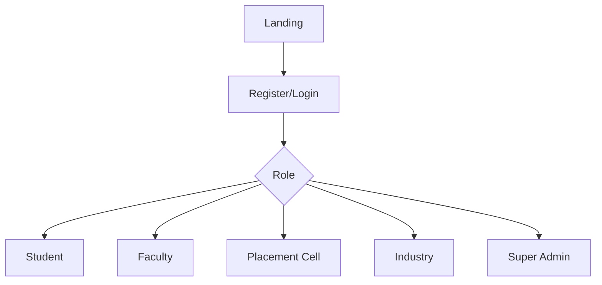

## 2. Authentication Flow
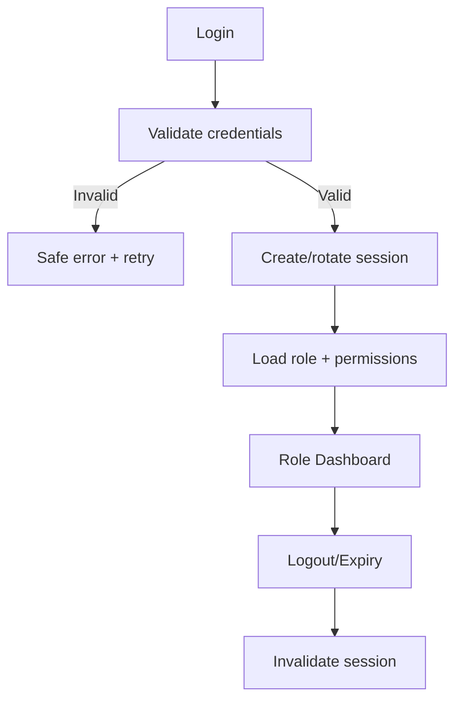

## 3. Student Flow
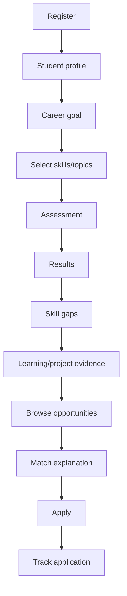

## 4. Assessment Flow
**Trigger:** Student starts an assessment.
1. Frontend requests assessment configuration.
2. Backend validates student permissions and selected skill/topic.
3. Assessment service invokes AI question-generation adapter.
4. Response is schema-validated.
5. Questions are persisted with configuration/version metadata.
6. Frontend displays the assessment.
7. Student submits answers.
8. Backend validates attempt state and answer payload.
9. Evaluation service invokes AI scoring adapter.
10. Scores are validated, normalized and persisted.
11. Frontend displays results only after completion.

## 5. AI Question Generation Flow
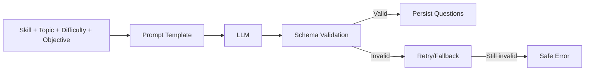

## 6. AI Scoring Flow
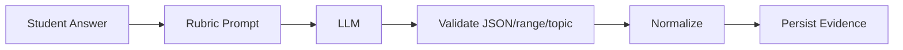

## 7. Skill Calculation Flow
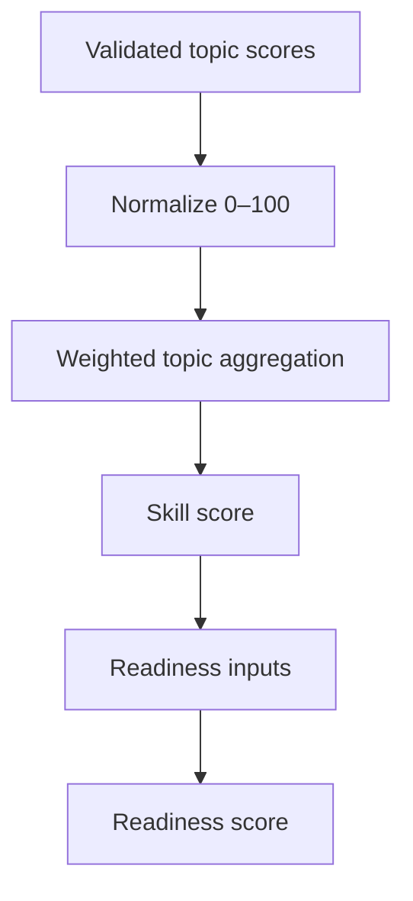
Exact weights are **Proposed** and must be versioned.

## 8. Skill Gap Flow
Target role requirements → compare required skill/topic minimums against validated student evidence → classify matched/partial/missing → identify highest-impact gaps → map to learning/project recommendations.

## 9. Recommendation Flow
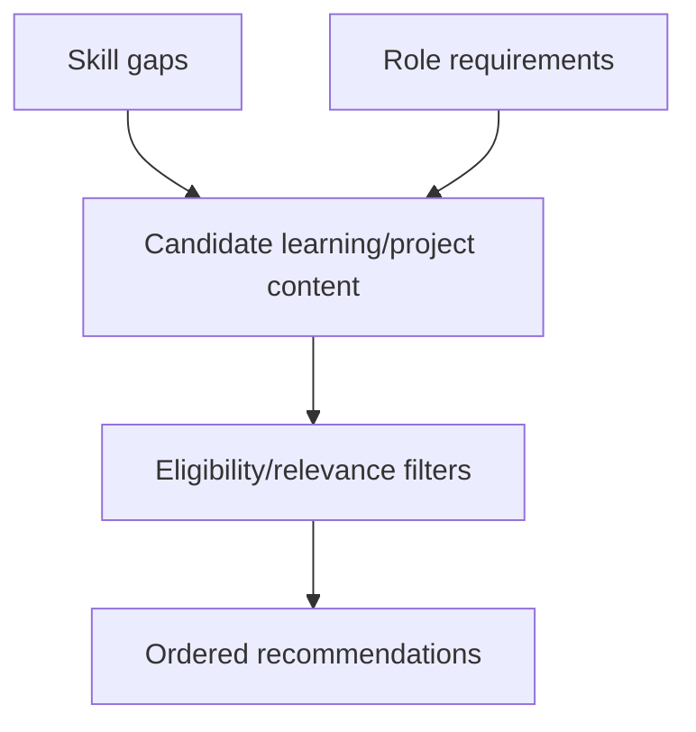
Advanced ML recommendations are Future Scope; deterministic rules are sufficient for MVP.

## 10. Job Matching Flow
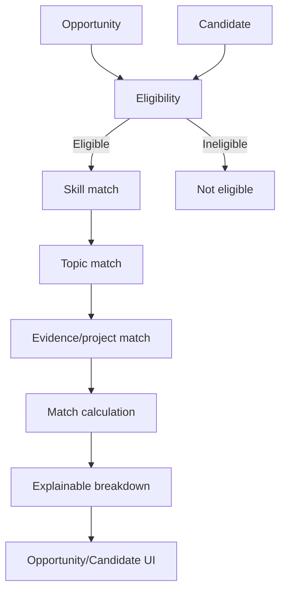

## 11. Internship Flow
Industry creates internship → defines requirements → publishes → eligible students discover → match explanation → apply → recruiter review → shortlist → feedback/status → outcome.

## 12. Application Flow
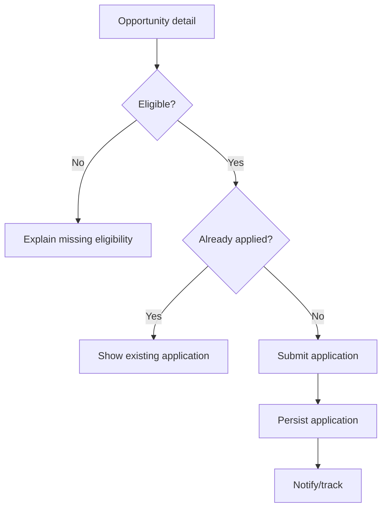

## 13. Portfolio Flow
Student adds education/project/certification/evidence → validation → save → optional verification → portfolio renders authorized evidence.

## 14. Industry Flow
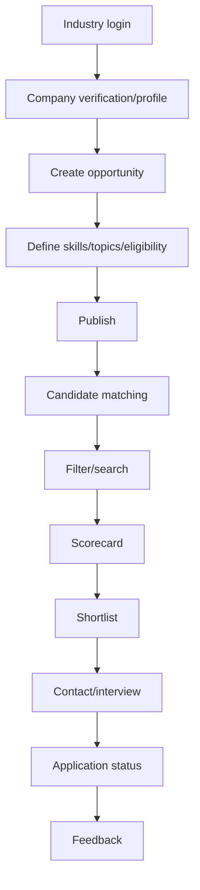

## 15. Faculty Flow
Login → dashboard → select department/authorized students → inspect skill analytics → identify gaps → recommend training → mentorship/workshops → track progress.

## 16. Placement Cell Flow
Login → dashboard → import student data → manage students/recruiters → create drive → publish opportunity → monitor applications → shortlist/selection → placement tracking → analytics.

## 17. Admin Flow
Login → dashboard → user management → institution management → skill/topic taxonomy → AI configuration → integrations → audit logs → analytics/system settings.

## 18. Document Verification Flow
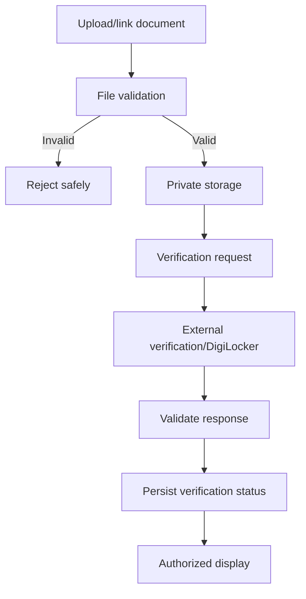

## 19. Notification Flow
Event occurs → backend creates notification → user sees in-app notification. Email/other delivery is **Optional**. Notification creation must not break the primary transaction.

## 20. Error Flows
### Invalid login
Show generic credential failure; do not disclose whether an account exists beyond the chosen authentication policy.
### Duplicate registration
Show field-level guidance and recovery path.
### Incomplete profile
Block only workflows that truly require missing data and identify required fields.
### Assessment timeout/interruption
Persist attempt state where supported; otherwise safely expire and allow configured retry.
### AI generation/scoring failure
Do not persist unvalidated score. Retry where safe; otherwise mark the operation failed and preserve existing valid data.
### API timeout
Show retry-safe state; do not duplicate mutation.
### Verification failure
Keep document status pending/failed with next action.
### Duplicate application
Enforce database uniqueness and return existing application state.
### Job expired/ineligible
Prevent submission and explain reason.
### Database failure
Return generic service error, log details server-side.
### Unauthorized access
Return appropriate authorization response without leaking resource data.
### Session expiry
Redirect to login and preserve safe return path where possible.
### Upload failure
Validate type/size and allow retry.
### Rate limit
Inform user to retry later without exposing implementation details.

## 21. Logout / Session Expiry
Logout invalidates server-side session. Expired sessions cannot access protected resources. Frontend clears authenticated state and routes to login.

## 22. Request Lifecycle Pattern
```text
Trigger
↓
User action
↓
Frontend validation/state
↓
API request
↓
Authentication + authorization
↓
Backend validation
↓
Service
↓
Database / AI / external service
↓
Validated response
↓
UI state update
```

## 23. Core State Principles
- Never assume frontend state is authoritative.
- Refresh critical authorization-dependent data from backend.
- Make mutations idempotent where practical.
- Define loading, success, empty and failure states for every network-driven screen.
