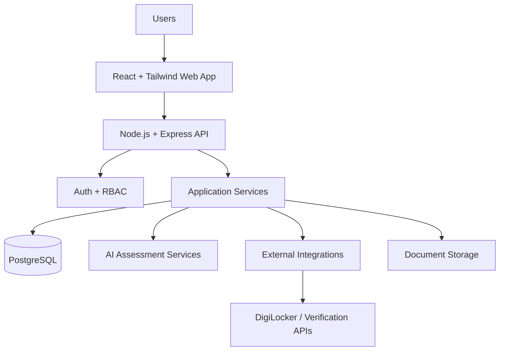
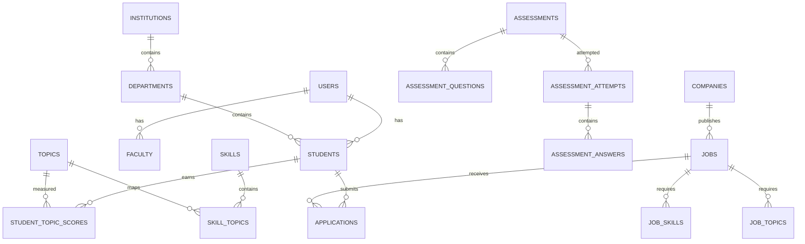
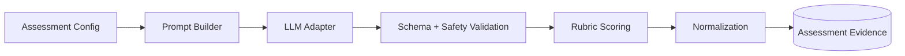
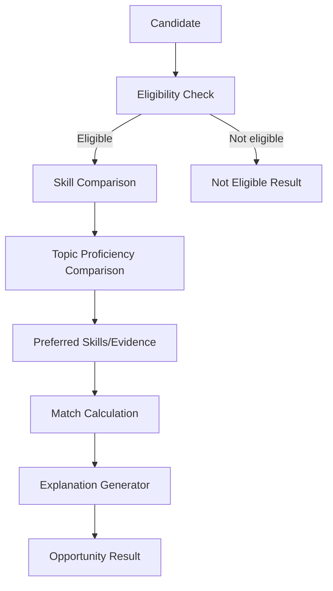
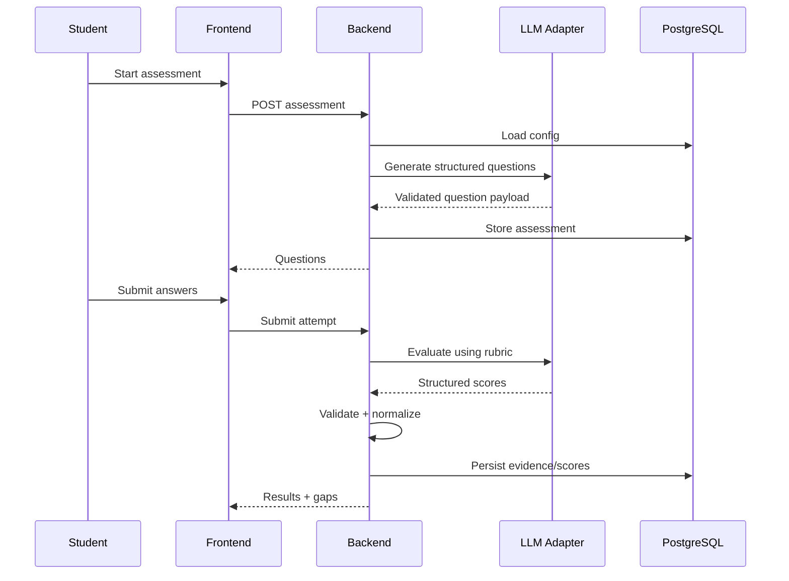
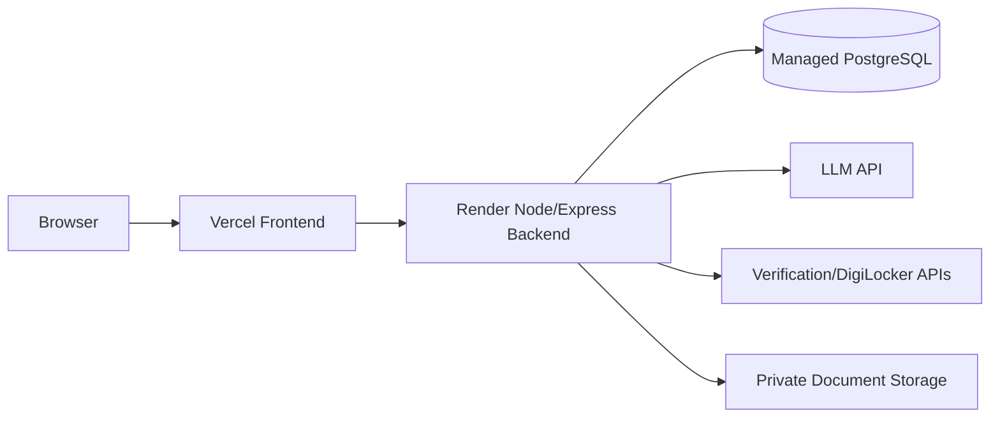

# Technical Requirements Document (TRD)
## Academia–Industry Collaboration Platform — SIH26044

## 1. Technical Overview
A modular React/Node/PostgreSQL web platform with session authentication, role-based authorization, AI-assisted assessment, deterministic scoring/matching and modular external integrations.

## 2. Architecture


## 3. Technology Stack
Frontend React/Tailwind; backend Node.js/Express; PostgreSQL; Express Session; password hashing; LLM API; external verification APIs/DigiLocker; Vercel frontend and Render backend. ORM/query library, object storage provider and cache are **Proposed/Optional** unless already selected in implementation.

## 4. System Components
- Web client
- Auth/RBAC middleware
- Profile service
- Skill taxonomy service
- Assessment service
- AI adapter
- Scoring service
- Gap-analysis service
- Opportunity service
- Matching service
- Application service
- Portfolio service
- Analytics service
- Document/verification adapter
- Notification service
- Audit service

## 5. Frontend Architecture
Use route-level role guards, reusable components, feature-oriented pages, a centralized API client, typed/validated response models where possible, and shared loading/error/empty components.

## 6. Backend Architecture
Recommended request flow:
```text
Route → Auth/RBAC middleware → Validation → Controller → Service → Repository/Integration → Response
```
Controllers should remain thin. Business rules belong in services. Database access belongs in repositories/data-access modules.

## 7. Database Architecture
Core entities:


## 8. Proposed Normalized Schema
| Table | Purpose | Key relationships |
|---|---|---|
| users | Authentication identity | role, institution |
| roles | Role definitions | users |
| institutions | Institutions | departments, users |
| departments | Academic units | institution, students |
| students | Student profile | user, department |
| faculty | Faculty profile | user, department |
| companies | Industry organizations | user/recruiter relationships |
| skills | Skill taxonomy | skill_topics |
| topics | Topic taxonomy | skill_topics |
| skill_topics | Skill-topic mapping | skills/topics |
| student_skills | Declared/derived skill association | student/skill |
| student_topic_scores | Evidence scores | student/topic |
| assessments | Assessment configuration | skill/topic |
| assessment_questions | Generated questions | assessment |
| assessment_attempts | Attempts | assessment/student |
| assessment_answers | Answers | attempt/question |
| assessment_scores | Validated scoring evidence | attempt/topic |
| projects | Student projects | student |
| project_skills | Project evidence mapping | project/skill |
| jobs | Job opportunities | company |
| internships | Internship opportunities | company |
| job_skills | Job requirements | job/skill |
| job_topics | Topic requirements | job/topic |
| applications | Opportunity applications | student/opportunity |
| shortlists | Recruiter decisions | application/company |
| certifications | Certifications | student |
| documents | Uploaded/linked documents | student |
| document_verifications | Verification outcomes | document |
| resumes | Resume metadata | student |
| portfolios | Portfolio metadata | student |
| mentorships | Mentorship relationships | student/faculty/industry |
| workshops | Training/workshops | institution/faculty |
| industry_feedback | Recruiter feedback | student/company |
| notifications | User notifications | user |
| sessions | Session persistence if required | user |
| audit_logs | Security/business audit | user/resource |

Exact table names and columns are **Proposed** and should be adapted to the selected migration strategy.

## 9. Database Constraints & Indexes
- Unique email/identity where appropriate.
- Unique application per student/opportunity.
- Foreign keys with intentional delete/update behavior.
- Index opportunity status/deadline, student department, skill/topic IDs, application status and common search fields.
- Check score ranges (0–100) and enumerated statuses.
- Version scoring configuration used to produce a result.

## 10. API Architecture
Base prefix: `/api`.

### Authentication
| Method | Endpoint | Auth |
|---|---|---|
| POST | /auth/register | Public |
| POST | /auth/login | Public |
| POST | /auth/logout | Authenticated |
| GET | /auth/me | Authenticated |

### Student
`GET/PUT /students/me`, `GET /students/me/skills`, `/assessments`, `/results`, `/recommendations`.

### Skills
`GET /skills`, `GET /skills/:id`, `GET /skills/:id/topics`.

### Assessment
`POST /assessments`, `GET /assessments/:id`, `POST /assessments/:id/submit`, `GET /assessments/:id/result`.

### Opportunities
`GET /jobs`, `GET /jobs/:id`, `POST/PUT/DELETE /jobs/:id`, `POST /jobs/:id/apply`; analogous internship/project endpoints may be added.

### Matching
`GET /matching/candidate/:candidateId/opportunity/:opportunityId`, `GET /matching/opportunity/:opportunityId/candidates`, `GET /student/recommendations` with strict authorization.

### Industry
`GET /companies/me`, `POST /jobs`, `POST /internships`, `GET /candidates`, `GET /candidates/:id`.

### Admin
`GET /admin/users`, `GET /admin/analytics`, `POST /admin/skills`, `POST /admin/topics`.

### Documents
`POST /documents/upload`, `POST /documents/verify`, `GET /documents/:id`.

Every endpoint must define method, authentication, authorization, request schema, query/params, response schema, errors, validation and rate limits where required.

## 11. Authentication
Express Session is the source-specified mechanism. Use secure cookie attributes, appropriate same-site policy, session rotation on login/privilege changes and server-side invalidation on logout. Passwords use a modern password-hashing algorithm. Exact library is **Proposed**.

## 12. Authorization
RBAC must be server-side. Resource ownership and institutional boundaries must be checked in addition to role checks.

## 13. Session Management
Handle expiry, logout, invalidation and concurrent-session policy. Exact session store is **Proposed**; avoid an in-memory store for production deployment if persistence/restart resilience is required.

## 14. AI Architecture

AI provider calls are isolated behind an adapter so the core application does not depend on one provider.

## 15. Assessment Engine
Input: skill/topic/difficulty/question type/objective. Generate question set. Store question metadata and version. Prevent answer-key exposure. Accept answers. Trigger evaluation. Validate output. Persist evidence and score only after validation.

## 16. Scoring Engine
Topic score = normalized validated evidence. Skill score = weighted topic aggregation. Readiness = configurable combination of assessment and evidence. Exact weights are **Proposed** until validated. Scores must store scoring-version/config metadata.

## 17. Matching Engine

The engine should separate hard eligibility from soft matching. Explanation must enumerate matched, partial and missing requirements. Weights are configurable and versioned.

Deterministic formula (MVP):
```text
skillScore = average candidate score across each required skill
 topicScore = average candidate score across each required topic
 evidenceScore = weighted coverage score from projects + internships + certifications + keyword match against required skills/topics
 eligibilityScore = 100 when the candidate meets the minimum proficiency and documentation requirements; 70 for conditional eligibility; 0 for not eligible
 finalScore = round((skillScore + topicScore + evidenceScore + eligibilityScore) / 4)
```

The score is deliberately explainable and derived only from structured data fields: required skills, candidate skill scores, required topics, candidate topic scores, minimum proficiency threshold, textual eligibility notes, and documented project/internship/certification evidence. The final value is not generated by an LLM.

## 18. Recommendation Engine
Use skill gaps and opportunity requirements to recommend relevant learning/topics/opportunities. Advanced ML recommendation is **Future Scope**; MVP can use deterministic gap-to-content rules.

## 19. Document Verification
Upload → validate file → store privately → create verification request → call adapter → validate provider response → persist status/evidence → expose only authorized result. External provider availability is not guaranteed.

## 20. DigiLocker Integration
DigiLocker is a modular integration. Authentication, consent, API contracts, scopes and document types depend on the actual integration program. Treat unavailable/denied integration as a recoverable state.

## 21. File Storage
Store documents outside the public frontend bundle. Use opaque identifiers and authorization checks. File size, MIME and extension validation are required. Malware scanning is **Recommended** if available.

## 22. Search
MVP may use PostgreSQL indexes and parameterized filters. Dedicated search/indexing is **Optional** until scale justifies it.

## 23. Notifications
Persist notifications with read/unread status. In-app delivery is **Recommended** for MVP; email and other channels are **Optional**.

## 24. Logging & Monitoring
Use structured application logs. Record security/audit events separately from debug logs. Never log passwords, session secrets, access tokens or full sensitive documents. External monitoring provider is **Optional**.

## 25. Security
Input validation, parameterized queries, XSS-safe rendering, CSRF protection where applicable, CORS restrictions, rate limiting, secure cookies, authorization checks, private documents, audit logs and environment-managed secrets.

## 26. API Error Contract
Recommended shape:
```json
{
  "error": {
    "code": "VALIDATION_ERROR",
    "message": "The request could not be processed.",
    "details": []
  }
}
```
Do not return internal stack traces to clients.

## 27. Data Flow


## 28. Deployment Architecture

Provider-specific networking, secrets and storage configuration are deployment concerns and must be configured without exposing credentials.

## 29. Environment Variables
**Proposed names:** `DATABASE_URL`, `SESSION_SECRET`, `LLM_API_KEY`, `FRONTEND_ORIGIN`, verification API credentials, DigiLocker credentials, storage credentials. Never commit actual values.

## 30. Performance
Optimize indexes, pagination, selective fields and batched queries. AI calls should not block unrelated requests. Exact latency/throughput targets are **Proposed** and require load testing.

## 31. Scalability
Start modular monolith rather than microservices. Introduce queues/cache/search services only when measured bottlenecks justify them. AI calls should be isolated behind a service boundary.

## 32. Backup & Recovery
Managed PostgreSQL backups are **Recommended**. Define retention, restore tests and recovery objectives before production. Uploaded documents require a separate backup policy.

## 33. Testing Strategy
Unit: scoring, normalization, eligibility, matching, validators. Integration: auth/RBAC, database transactions, assessment lifecycle. E2E: student assessment/application and recruiter candidate workflow. Security: authorization bypass, upload abuse, session and CSRF checks. AI: schema/rubric regression fixtures.

## 34. CI/CD
Automated lint/test/build on pull requests is **Recommended**. Deployment to Vercel/Render can use their native pipelines. Database migrations must run in a controlled release step.

## 35. Error Handling
All specified edge cases require user-safe messages, retry where appropriate, logging and safe fallback: invalid login, duplicate registration, incomplete profile, timeout/interruption, AI failure, malformed AI output, API timeout, verification failure, duplicate application, expired job, ineligibility, DB failure, unauthorized access, session expiry, upload failure and rate limiting.

## 36. Future Architecture
Advanced recommendations, multi-campus analytics, trend prediction, curriculum intelligence and more integrations remain Future Scope. They must preserve the core evidence/RBAC/explainability principles.
